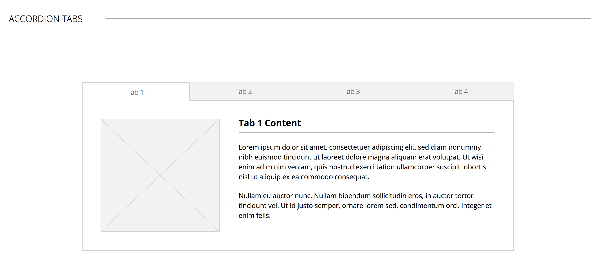
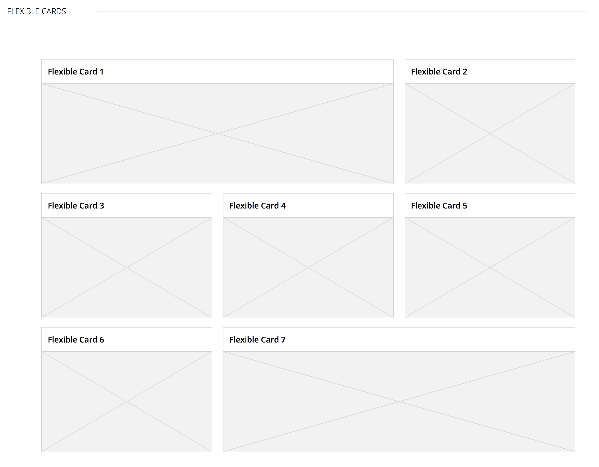
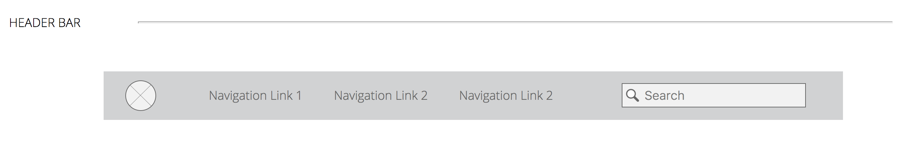

#  Pattrn Party

* [Original Comp](http://frontend.turing.io/projects/pattrn-party.html)
* [Deployed Style Guide](https://jeremiahjstanley.github.io/pattrn-party/)

## Style Guide

#### Synopsis:

The goal of this project was to build a small library of page components that can be quickly and easily dropped into a project with minimal work to integrate them into a codebase. This was a project developed for a class at the Turing School of Software and Design.

#### Background

This idea of having a small library of page components is outlined in Brad Frost's Style Guide.  The main focus on this project was to write semantic HTML, well organized and clear CSS, and dry, well factored Javascript. You can click on any of the buttons in order to be linked to a CodePen with that component's code.

#### Tools

* [HTML5](https://developer.mozilla.org/en-US/docs/Web/Guide/HTML/HTML5)
* [CSS3](https://developer.mozilla.org/en-US/docs/Web/CSS/CSS3)
* [JavaScript](https://developer.mozilla.org/en-US/docs/Web/JavaScript)
* [jQuery](https://developer.mozilla.org/en-US/docs/Glossary/jQuery)

#### CONTRIBUTORS
[Jeremiah Stanley](https://github.com/jeremiahjstanley/pattrn-party)